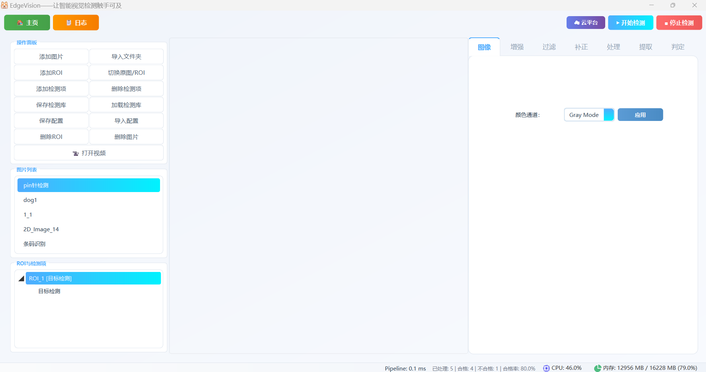
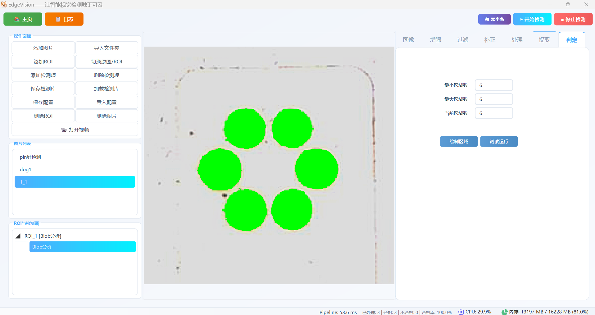
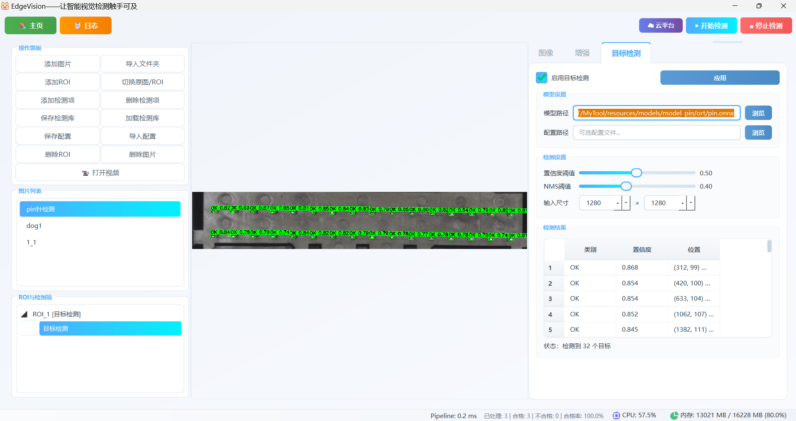
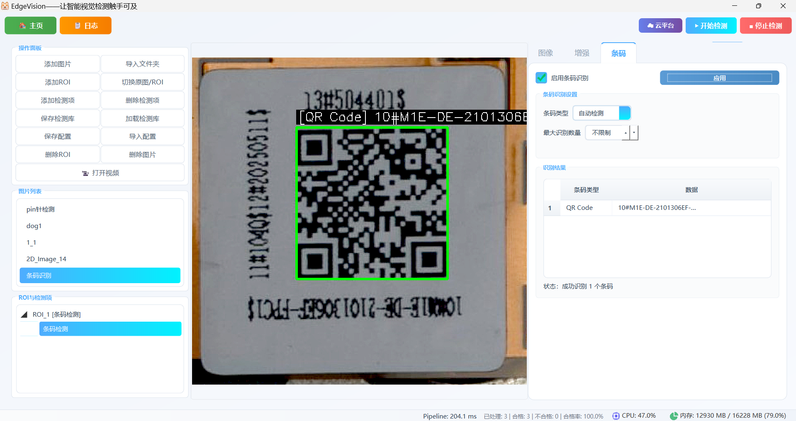
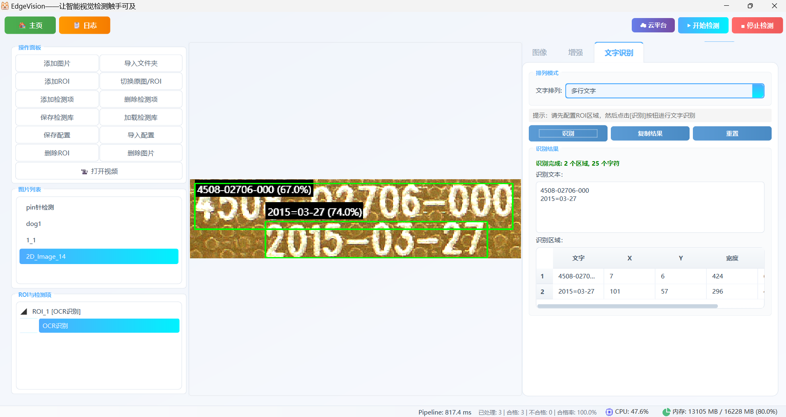
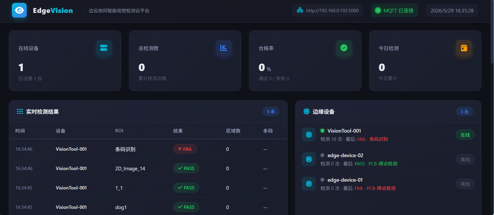

# EdgeVision — 边云协同智能视觉检测系统

<p align="center">
  
</p>

<p align="center">
  <strong>面向工业产线的可配置化智能视觉检测平台</strong>
</p>

<p align="center">
  
  
  
  
  
  
</p>

---

## 📖 项目背景

在工业自动化产线中，**视觉检测**是保障产品质量的关键环节。传统视觉检测工具存在以下痛点：

| 痛点 | 现状 | EdgeVision 的解法 |
|------|------|-------------------|
| **检测流程固定** | 更换产品需重新编程 | ✅ 可配置化 Pipeline，拖拽组合检测步骤 |
| **算法单一** | 传统算法或深度学习二选一 | ✅ 传统算法 + YOLO 深度学习 + 条码识别 + OCR融合 |
| **部署成本高** | 需要工业相机 + 专用工控机 | ✅ 普通 PC + USB 摄像头即可运行 |
| **数据孤岛** | 检测结果无法远程监控 | ✅ MQTT 边云协同，云端实时看板 |
| **GPU 利用率低** | 深度学习推理未加速 | ✅ ONNX Runtime + CUDA GPU 加速推理 |
| **文字识别困难** | 手动录入产品信息 | ✅ OCR自动识别中英文文字 |

EdgeVision 旨在打造一个**低成本、易配置、可扩展**的智能视觉检测平台，让中小型企业也能快速部署视觉质检方案。

---

## ✨ 核心亮点

### 🧩 可配置化 Pipeline 引擎
```
颜色通道 → 图像增强 → 统一过滤 → 算法队列 → 形状筛选 → 直线检测 → 条码识别 → 滤波去噪 → OCR文字识别
```
- **9 大处理步骤**自由组合，零代码搭建检测流程
- 每个步骤独立配置，实时预览效果
- 支持保存/加载检测方案，不同产品一键切换
- **可选执行**：通过 stepEnabled 数组控制每个步骤是否启用

### 🧠 多模态检测能力
- **传统图像处理**：形态学操作、连通域分析、形状变换、面积筛选
- **深度学习推理**：YOLO 系列目标检测，ONNX Runtime GPU 加速
- **条码/QR Code 识别**：基于 ZXing-CPP，支持 10+ 种条码格式
- **直线检测**：HoughP / LSD / EDline 三种算法，支持参考线匹配
- **OCR文字识别**：基于 Tesseract OCR，支持中英文识别

### ☁️ 边云协同架构
```
┌─────────────┐        MQTT Broker        ┌──────────────────┐
│  EdgeVision │◄──── (MQTT 5.0) ────────►│  Cloud Dashboard │
│  桌面端 C++ │                            │  Flask Web 看板  │
│             │  检测结果实时上报            │  实时数据推送     │
│  ● GPU推理  │  设备心跳保活              │  合格率统计      │
│  ● ROI管理  │  云端远程指令              │  历史数据查询    │
│  ● Pipeline │  自动重连                  │  设备状态监控    │
└─────────────┘                           └──────────────────┘
```

### 🎯 工业级特性
- **检测方案持久化**：ROI 布局 + 检测参数 + 模板库完整保存，支持跨设备复用
- **批量检测**：自动遍历多张图片，实时统计合格率，不合格图片标记导出
- **视频流处理**：支持视频文件和 USB 摄像头实时检测
- **ROI 管理**：多 ROI 独立配置，坐标归一化适配不同分辨率
- **线程安全**：Pipeline 后台异步执行，UI 响应流畅

---

## 🏗️ 系统架构

项目采用 **六层分层架构**，职责清晰，依赖单向：

```
┌──────────────────────────────────────────────────────────┐
│                       UI 层                               │
│   MainWindow · ImageView · SignalConnector · Toast       │
│   (QMainWindow · 信号槽 · 图像渲染 · 交互事件)            │
├──────────────────────────────────────────────────────────┤
│                    Widgets 层                              │
│   ImageTab · VideoTab · EnhanceTab · FilterTab           │
│   ProcessTab · ExtractTab · JudgeTab · LineTab            │
│   TemplateTab · BarcodeTab · ObjectDetectionTab          │
│   ProfileTab · BatchDetectionTab · OcrTab                │
├──────────────────────────────────────────────────────────┤
│                  Controllers 层                            │
│   AutoDetectionController · DetectionUiController        │
│   RoiUiController · ProfileController                    │
├──────────────────┬───────────────────────────────────────┤
│     Core 层       │         Algorithm 层                   │
│   Pipeline        │   ImageProcessor · OpenCVAlgorithm    │
│   PipelineManager │   DnnInference · OrtInference (GPU)  │
│   RoiManager      │   ZXingBarcodeReader                  │
│   ProfileManager  │   TesseractOcrEngine                  │
│   VideoManager    │   MatchStrategy                       │
│   VideoManager    │                                       │
│   MqttManager     │                                       │
├──────────────────┴───────────────────────────────────────┤
│                Config / Data 层                            │
│   PipelineConfig · DetectionItem · RoiConfig              │
│   ShapeFilterConfig · InspectionProfile · BarcodeResult   │
│   OcrConfig · OcrRegion                                   │
└──────────────────────────────────────────────────────────┘
                          │
                          ▼
┌──────────────────────────────────────────────────────────┐
│              Cloud Platform (Python Flask)                │
│   MQTT Subscriber · SQLite Persistence · SSE Push       │
│   Chart.js Statistics · Remote Command API               │
└──────────────────────────────────────────────────────────┘
```

---

## 🔧 技术栈

### 桌面端 (C++20)

| 技术 | 版本 | 用途 |
|------|------|------|
| **C++20** | — | 核心开发语言，利用 concepts/ranges 等现代特性 |
| **Qt 6** | 6.x | 跨平台 GUI 框架，信号槽通信机制 |
| **OpenCV** | 4.8 | 图像处理核心库（imgproc, dnn, videoio, features2d, calib3d 等） |
| **ONNX Runtime** | GPU | 深度学习推理引擎，CUDA GPU 加速 YOLO 目标检测 |
| **ZXing-CPP** | — | 条码 / QR Code 多格式识别 |
| **Tesseract OCR** | 5.x | OCR 文字识别引擎，支持中英文 |
| **Paho MQTT** | 5.0 | MQTT 客户端，边云协同通信 |
| **spdlog** | — | 高性能日志系统 |
| **CMake** | 3.16+ | 跨平台构建系统 |

### 云平台 (Python)

| 技术 | 用途 |
|------|------|
| **Flask** | Web 后端框架 |
| **Paho MQTT Python** | MQTT 订阅/发布 |
| **SQLite** | 轻量级数据持久化 |
| **Chart.js** | 实时统计图表 |
| **Server-Sent Events** | 服务端实时数据推送 |

---

## 📸 效果展示


### 桌面端主界面


### 传统Blob分析（斑点搜寻）


### 深度学习目标检测


### 条码识别


### OCR字符识别


### 云平台看板


---

## 📊 性能指标

| 指标 | 数值 | 测试环境 |
|------|------|----------|
| YOLOv8n 推理速度 | ~300ms/帧 | GTX1650 + CUDA |
| 传统Pipeline延迟 | ~40ms/帧 | Intel i5-9300H |
| 条码识别成功率 | >95% (QR Code) | 工业现场图片 |
| OCR识别速度 | ~100ms/字 | Intel i5-9300H |

---

## 🚀 快速开始

### 系统要求

- **操作系统**：Windows 10/11 (x64)
- **编译器**：Visual Studio 2022 (支持 C++20)
- **构建工具**：CMake 3.16+
- **Qt**：6.x
- **Python**：3.8+（云平台看板）
- **Tesseract OCR**：5.x（OCR文字识别功能需要）
- **GPU**（可选）：NVIDIA GPU + CUDA Toolkit（用于深度学习 GPU 加速）

### 编译运行

```bash
# 1. 克隆仓库
git clone https://github.com/xiaoyuan1021/MyTool.git
cd MyTool

# 2. 配置构建（指定 Qt 路径）
cmake -B build/Debug -DCMAKE_PREFIX_PATH="path/to/Qt/6.x.x/msvc2022_64"

# 3. 编译
cmake --build build/Debug --config Debug

# 4. 运行
./build/Debug/bin/VisionTool.exe
```

### 云平台启动

```bash
# 进入云平台目录
cd cloud_dashboard

# 安装依赖
pip install -r requirements.txt

# 启动服务
python app.py

# 浏览器访问 http://localhost:5000
```

---

## 📁 项目结构

```
EdgeVision/
├── 3rdparty/                    # 第三方库
│   ├── opencv/                  # OpenCV 4.x (含 ximgproc, dnn 等模块)
│   ├── onnxruntime/             # ONNX Runtime GPU (CUDA 加速)
│   ├── paho-mqtt/               # Paho MQTT C++ 客户端
│   ├── spdlog/                  # 高性能日志库
│   ├── zxing/                   # ZXing-CPP 条码识别
│   └── tesseract/               # Tesseract OCR 文字识别
│
├── include/                     # 头文件
│   ├── algorithm/               # 算法层：图像处理、DNN推理、条码识别、OCR识别
│   ├── config/                  # 配置层：Pipeline、ROI、检测参数、OCR配置
│   ├── controllers/             # 控制器层：批量检测、ROI交互、配置管理
│   ├── core/                    # 核心层：Pipeline引擎、MQTT通信、方案管理
│   ├── data/                    # 数据层：区域特征、条码结果、OCR结果、检测报告
│   ├── ui/                      # UI组件：主窗口、图像视图、Toast通知
│   └── widgets/                 # Widget层：各功能Tab、ROI列表、图片管理
│
├── src/                         # 源文件
│   ├── algorithm/               # 算法实现
│   ├── config/                  # 配置实现
│   ├── controllers/             # 控制器实现
│   ├── core/                    # 核心引擎实现
│   ├── ui/                      # UI组件实现
│   ├── widgets/                 # Widget实现
│   └── main.cpp                 # 程序入口
│
├── ui/                          # Qt Designer UI 文件
│   ├── mainwindow.ui            # 主窗口布局
│   ├── home_page.ui             # 系统概览页
│   ├── log_page.ui              # 日志页
│   └── tabs/                    # 各功能Tab的UI布局
│
├── resources/                   # 资源文件
│   ├── icons/                   # 图标资源
│   ├── models/                  # 深度学习模型 (YOLOv8n ONNX)
│   ├── template/                # 模板匹配图像
│   ├── style.qss                # 全局样式表
│   └── res.qrc                  # Qt 资源文件
│
├── cloud_dashboard/             # 云平台看板 (Python Flask)
│   ├── app.py                   # Flask 后端 + MQTT 订阅
│   ├── templates/index.html     # 前端页面 (暗色主题仪表盘)
│   ├── dashboard.db             # SQLite 数据库
│   └── requirements.txt         # Python 依赖
│
├── logs/                        # 运行日志
├── CMakeLists.txt               # CMake 构建配置
├── app_config.json              # 应用默认配置
└── README.md                    # 项目说明
```

---

## 🔄 处理管线 (Pipeline)

Pipeline 是 EdgeVision 的核心引擎，采用**可配置步骤链模式**，用户可自由组合检测步骤：

```
输入图像 (BGR)
    │
    ▼
┌─────────────────────┐
│  Step 1: 颜色通道     │  Gray / RGB / HSV / 单通道
└─────────┬───────────┘
          ▼
┌─────────────────────┐
│  Step 2: 图像增强     │  亮度 + 对比度 + Gamma + 锐化
└─────────┬───────────┘
          ▼
┌─────────────────────┐
│  Step 3: 统一过滤     │  灰度/RGB/HSV 范围过滤（合并原灰度过滤和颜色过滤）
└─────────┬───────────┘
          ▼
┌─────────────────────┐
│  Step 4: 算法队列     │  形态学处理（开闭运算/膨胀腐蚀/连通域/填充/面积筛选）
└─────────┬───────────┘
          ▼
┌─────────────────────┐
│  Step 5: 形状筛选     │  面积、圆度、凸性、矩形度 (AND/OR 逻辑)
└─────────┬───────────┘
          ▼
┌─────────────────────┐
│  Step 6: 直线检测     │  HoughP / LSD / EDline + 参考线匹配（合并原直线检测和参考线匹配）
└─────────┬───────────┘
          ▼
┌─────────────────────┐
│  Step 7: 条码识别     │  ZXing 多格式条码 / QR Code
└─────────┬───────────┘
          ▼
┌─────────────────────┐
│  Step 8: 滤波去噪     │  高斯/中值/双边/形态学滤波
└─────────┬───────────┘
          ▼
┌─────────────────────┐
│  Step 9: OCR文字识别  │  Tesseract OCR（中英文识别）
└─────────┬───────────┘
          ▼
输出: 区域特征 + 判定结果 + 可视化叠加
```

> **注意**：以上步骤均为**可选**，用户可通过 `stepEnabled` 数组控制每个步骤是否启用，并非每次检测都执行所有步骤。实际执行顺序由 `stepOrder` 数组决定。

### 形态学处理步骤详解

| 算法 | 说明 | 典型应用 |
|------|------|----------|
| 圆形开/闭运算 | 圆形结构元素形态学操作 | 去噪 / 填充小孔 |
| 矩形开/闭运算 | 矩形结构元素形态学操作 | 去除线性噪声 |
| 圆形膨胀/腐蚀 | 扩张/收缩前景区域 | 断开粘连 / 增强特征 |
| 联合 (Union) | 合并所有连通域 | 区域合并 |
| 连通域 (Connection) | 连通域标记与分析 | 区域计数 |
| 填充孔洞 (FillUp) | 填充二值图像中的孔洞 | 完善目标区域 |
| 形状变换 (ShapeTrans) | 凸包、最小外接矩形、拟合圆/椭圆 | 形状规范化 |
| 面积筛选 (SelectShape) | 按面积范围筛选连通域 | 去除干扰区域 |

---

## ☁️ 边云协同

### 通信协议

EdgeVision 使用 **MQTT 5.0** 协议实现边云通信，支持以下 Topic：

| Topic | 方向 | 用途 |
|-------|------|------|
| `visiontool/results` | 边缘 → 云端 | 检测结果实时上报 |
| `visiontool/heartbeat` | 边缘 → 云端 | 设备心跳保活 |
| `visiontool/commands` | 云端 → 边缘 | 远程控制指令 |

### 检测结果数据格式

```json
{
  "reportId": "a1b2c3d4e5f6",
  "deviceId": "VisionTool-001",
  "roiName": "PCB-焊点检测",
  "timestamp": 1713945600000,
  "result": {
    "passed": true,
    "totalRegionCount": 5,
    "originalRegionCount": 8
  },
  "regions": [
    {
      "index": 1,
      "area": 256.5,
      "circularity": 0.85,
      "centerX": 320.0,
      "centerY": 240.0
    }
  ],
  "barcodes": [
    {
      "type": "QRCode",
      "data": "SN-2024-A001",
      "quality": 1.0
    }
  ]
}
```

### 云平台功能

- **设备状态监控**：在线/离线状态、心跳时间、运行时长
- **实时数据推送**：基于 SSE (Server-Sent Events) 的毫秒级数据更新
- **统计分析**：合格率趋势、ROI 维度统计、检测量统计
- **历史数据查询**：分页浏览、时间范围筛选
- **远程指令**：通过 Web 界面向边缘端发送采集/启停指令

---

## 🎯 应用场景

### 场景一：PCB 焊点检测
- 利用颜色过滤 + 形态学处理识别焊点区域
- 通过面积筛选和圆度判定焊点质量
- 批量检测多张 PCB 图片，统计合格率

### 场景二：零件尺寸测量
- 利用模板匹配定位零件位置
- 通过形状变换（最小外接矩形、拟合圆）提取尺寸特征
- 判定尺寸是否在公差范围内

### 场景三：产品条码追溯
- 自动识别产品上的 QR Code / 条形码
- 解码内容与数据库比对，验证产品信息
- 支持旋转、模糊、低对比度等复杂场景

### 场景四：产线实时监控
- USB 摄像头实时采集 + YOLO 目标检测
- 检测结果通过 MQTT 实时上报云端
- 云平台看板远程监控产线状态

### 场景五：OCR文字识别
- 自动识别产品包装上的文字信息
- 支持中英文混合识别
- 适用于生产日期、批号、序列号等文字检测

---

## 🛠️ 扩展指南

### 新增 Pipeline 步骤

1. 在 `include/core/pipeline_steps.h` 中实现 `IPipelineStep` 子类
2. 在 `src/core/pipeline_steps.cpp` 中实现 `run()` 方法
3. 在 `PipelineManager::initPipeline()` 中注册步骤

### 新增检测类型

1. 在 `include/config/detection_type.h` 中添加 `DetectionType` 枚举值
2. 在 `include/config/detection_config_types.h` 中添加配置结构体
3. 在 `DetectionItem` 构造函数中初始化默认配置
4. 创建对应的 Tab Widget，实现 `ISignalConnectable` 接口

### 设计原则

- **解耦**：通过 `ISignalConnectable` 接口解耦 Tab Widget 与核心模块
- **单职**：MainWindow 通过组合 Manager/Controller 编排功能
- **可扩展**：新增检测类型只需添加枚举 + 配置结构体 + Tab Widget
- **线程安全**：PipelineManager 使用互斥锁 + 原子标志 + 值拷贝交换数据

---

## 📄 许可证

本项目基于 [MIT 许可证](LICENSE) 开源。

---

<p align="center">
  <strong>EdgeVision</strong> — 让智能视觉检测触手可及
</p>